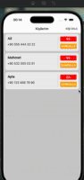

# Contacts App

📝 Contacts project is a simple contact application that can be used on iOS and Android devices that I created to learn Redux and improve my skills in creating mobile applications.

# 🚀 Features

- 📇 Add new contacts
  
- 📝 Edit existing contact information
  
- ❌ Delete contact
  
- 🔍 View a simple and clean list of saved contacts
  
- 📱 iOS & Android compatibility

# 🛠️ Teknologies Used

-

# 🎥 ScreenShot

